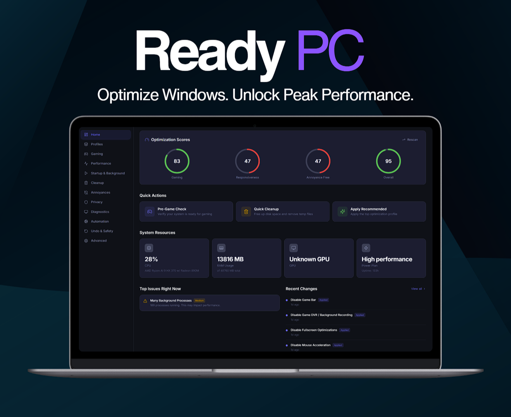

<p align="center">
  
</p>

<h1 align="center">ReadyPC</h1>

<p align="center">
  <strong>Free open-source Windows optimizer and debloater for gaming, performance, privacy, and a cleaner PC experience.</strong>
</p>

<p align="center">
  ReadyPC helps you optimize Windows, reduce background bloat, improve responsiveness, and apply safe reversible tweaks in a fast lightweight desktop app.
</p>

<p align="center">
  <a href="https://github.com/Gloom-Team/ReadyPC/releases/latest"></a>
  <a href="https://github.com/Gloom-Team/ReadyPC/releases/latest"></a>
</p>

<p align="center">
  <a href="LICENSE"></a>
  <a href="https://www.rust-lang.org/"></a>
  <a href="https://tauri.app/"></a>
  <a href="https://react.dev/"></a>
  <a href="https://github.com/Gloom-Team/ReadyPC/stargazers"></a>
</p>

<p align="center">
  <a href="https://github.com/Gloom-Team/ReadyPC/releases/latest"><strong>Download ReadyPC</strong></a> •
  <a href="#why-download-readypc"><strong>Why Download</strong></a> •
  <a href="#features"><strong>Features</strong></a> •
  <a href="#installation"><strong>Build from Source</strong></a>
</p>

<p align="center">
  <a href="https://github.com/Gloom-Team/ReadyPC/releases/latest">
    
  </a>
</p>

---

## Download ReadyPC

**Download the latest version here:**

## **[⬇ Download ReadyPC for Windows](https://github.com/Gloom-Team/ReadyPC/releases/latest)**

ReadyPC is a free open-source **Windows optimizer** built for people who want better gaming performance, fewer background annoyances, stronger privacy, and a cleaner Windows setup without shady one-click tools.

If you want the fastest way to get started, go straight to the latest release and download ReadyPC now.

---

## ReadyPC | Free Open-Source Windows Optimizer for Gaming and Performance

**ReadyPC** is a free open-source **PC optimizer** and **Windows optimization tool** designed to help improve **gaming performance**, system responsiveness, privacy, and everyday usability.

Unlike sketchy cleaners and fake booster apps, ReadyPC focuses on **safe, reversible Windows tweaks** with clear explanations, local backups, and a full change log so you always know what changed.

ReadyPC is built for users searching for:

- Windows optimizer
- PC optimizer
- gaming optimizer
- Windows debloat tool
- performance tweak tool
- privacy tweak app
- lightweight Windows utility

Everything runs locally on your PC. No account. No nonsense. No fake promises.

---

## Why Download ReadyPC

People download ReadyPC because it makes Windows optimization easier to understand and safer to use.

- **Fast to use**  
  Apply useful Windows tweaks in seconds

- **Safe and reversible**  
  Every tweak can be undone

- **Clear and transparent**  
  See what each tweak does, why it helps, and how risky it is

- **Built for gaming and speed**  
  Reduce background overhead and improve responsiveness

- **Privacy focused**  
  Cut down telemetry, ads, nags, and unnecessary Windows clutter

- **Lightweight desktop app**  
  Built with Rust and Tauri for speed and efficiency

- **Free and open-source**  
  Download it, inspect it, and use it without lock-in

## **[Download ReadyPC Now](https://github.com/Gloom-Team/ReadyPC/releases/latest)**

---

## Features

### One-Click Optimization Profiles

ReadyPC includes one-click profiles so users can download the app and start optimizing Windows right away.

| Profile | Best For | What It Helps With |
|---|---|---|
| **Gaming Mode** | Competitive play, streaming, lower background usage | Reduces overlays, background apps, Game Bar clutter, and unnecessary overhead |
| **Performance Mode** | Everyday speed and smoother system response | Improves responsiveness with useful performance and cleanup tweaks |
| **Quiet / Focus Mode** | Work, school, fewer distractions | Cuts notifications, nags, ads, and interruptions |
| **Low-End PC Mode** | Older hardware and budget systems | Trims visual overhead and background activity for a snappier feel |

### Safe Tweak Engine

Every tweak explains:

- What it does
- Why it may help
- Risk level
- Expected impact
- Whether it can be reversed

That means no mystery buttons and no undocumented changes.

### 45+ Windows Tweaks Across 7 Categories

ReadyPC includes a growing library of Windows tweaks for gaming, performance, cleanup, and privacy.

| Category | Count | Examples |
|---|---:|---|
| **Gaming** | 8 | Game Bar, Game DVR, HAGS, mouse acceleration, Nagle's algorithm |
| **Annoyance Removal** | 15 | Tips, nags, Widgets, Copilot, Sticky Keys, ads, telemetry |
| **Performance** | 10 | Background apps, SysMain, search indexing, processor scheduling |
| **Visual Effects** | 6 | Transparency, animations, shadows, Aero Peek |
| **Startup** | 1 | Startup delay removal |
| **Cleanup** | 2 | Temp files, prefetch cache |
| **Power** | 2 | High Performance, Ultimate Performance |

### Benchmark-Lite Snapshots

See before-and-after changes with quick system snapshots that include:

- Startup app count
- Idle RAM usage
- Idle CPU usage
- Background process count
- Power plan detection
- Side-by-side comparison

### Full Change Log and Undo

ReadyPC logs every applied tweak locally with timestamps so you can stay in control.

- Undo individual tweaks
- Revert all applied changes
- Export logs as JSON
- Review exactly what changed

---

## Why ReadyPC Stands Out

Most Windows optimizer apps sell hype.

ReadyPC focuses on clarity, safety, and control.

- No fake boost claims
- No mystery tweaks
- No forced accounts
- No bloated Electron shell
- No hidden background services

Just a clean downloadable Windows optimizer built to help real users improve their PCs.

## **[Download the Latest ReadyPC Release](https://github.com/Gloom-Team/ReadyPC/releases/latest)**

---

## Installation

## Download the App

For most users, the best option is to download the latest release:

## **[⬇ Download ReadyPC](https://github.com/Gloom-Team/ReadyPC/releases/latest)**

---

## Build from Source

```bash
git clone https://github.com/Gloom-Team/ReadyPC.git
cd ReadyPC
pnpm install
pnpm tauri dev
pnpm tauri build
